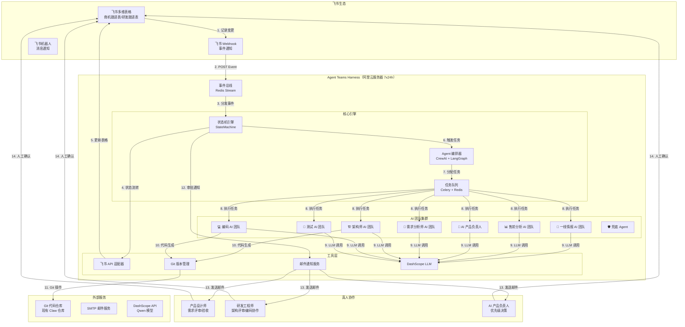
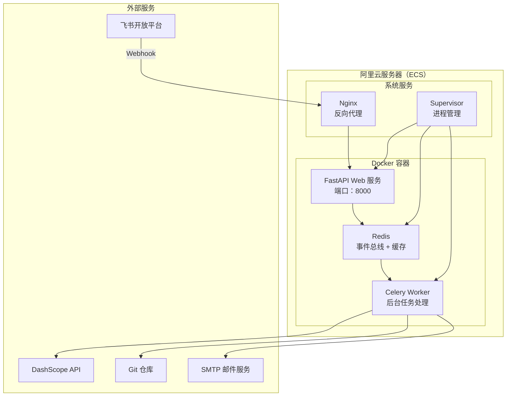

# Agent Teams Harness - 技术架构设计

> 版本: v1.2
> 更新日期: 2026-03-31
> 更新内容: 新增 UAT 验收流程（测试通过 → UAT → 合并主干 → 产品发版）、UAT Service、Release Service、2 张新数据表（uat_records/releases）

## 1. 系统总览



## 2. 分层架构

### 2.1 事件接入层（Event Ingestion Layer）

```python
# src/infrastructure/feishu/webhook_handler.py

class FeishuWebhookHandler:
    """
    飞书 Webhook 事件接入
    
    职责:
    1. 接收飞书多维表格变更事件（record.created/updated/deleted）
    2. 验证签名（确保请求来自飞书）
    3. 解析事件数据，转换为标准 Event 对象
    4. 发布到事件总线（Redis Stream）
    """
    
    async def handle(self, request: Request) -> Response:
        # 1. 验证签名
        signature = request.headers.get("X-Feishu-Signature")
        if not self.verify_signature(request.body, signature):
            return Response(status=401)
        
        # 2. 解析事件
        event = FeishuEvent.parse_raw(request.body)
        
        # 3. 发布到事件总线
        await self.event_bus.publish("feishu_events", event)
        
        # 4. 返回挑战值（飞书要求）
        if event.type == "url_verification":
            return Response(body={"challenge": event.challenge})
        
        return Response(status=200)
```

**技术选型**:
- **FastAPI**: 异步 Web 框架，高性能
- **Redis Stream**: 事件总线，支持消息持久化和消费者组
- **飞书开放平台 SDK**: `lark-oapi`（官方 Python SDK）

---

### 2.2 状态机引擎（State Machine Engine）

```python
# src/core/state_machine.py

class StateMachine:
    """
    状态机引擎 - 系统的"中枢神经系统"
    
    职责:
    1. 维护所有实体（Intent/Feature/Requirement）的状态
    2. 定义状态转换规则（TRANSITIONS）
    3. 监听事件，触发状态转换
    4. 状态变更后，触发对应的 Agent 团队
    5. 更新飞书多维表格状态字段
    """
    
    # 状态转换规则
    TRANSITIONS = {
        # 意向流程
        (IntentStatus.NEW, "evaluate"): IntentStatus.EVALUATING,
        (IntentStatus.EVALUATING, "prioritize"): IntentStatus.P0_HIGH_VALUE,
        (IntentStatus.P0_HIGH_VALUE, "approve"): IntentStatus.APPROVED,
        
        # 需求流程
        (RequirementStatus.DRAFT, "analyze"): RequirementStatus.IN_ANALYSIS,
        (RequirementStatus.IN_ANALYSIS, "submit_review"): RequirementStatus.IN_REVIEW,
        (RequirementStatus.IN_REVIEW, "approve"): RequirementStatus.IN_TECHNICAL_DESIGN,
        (RequirementStatus.IN_TECHNICAL_DESIGN, "design_complete"): RequirementStatus.IN_DEVELOPMENT,
        (RequirementStatus.IN_DEVELOPMENT, "dev_complete"): RequirementStatus.IN_TESTING,
        (RequirementStatus.IN_TESTING, "test_pass"): RequirementStatus.DONE,
    }
    
    async def process_event(self, event: FeishuEvent):
        """处理事件，触发状态转换"""
        entity = await self.load_entity(event)
        action = self.determine_action(event, entity)
        
        if self.can_transition(entity, action):
            await self.transition(entity, action)
            await self.trigger_agent_team(entity)
            await self.notify_approvers(entity)
```

**关键设计**:
- **状态持久化**: 飞书多维表格作为唯一真实来源（Single Source of Truth）
- **幂等性**: 同一事件多次触发不会导致状态错误
- **可追溯性**: 每次状态转换记录日志（谁、何时、为什么）

---

### 2.3 Agent 编排层（Agent Orchestration Layer）

```python
# src/core/orchestrator.py

class AgentOrchestrator:
    """
    Agent 编排器 - 系统的"大脑"
    
    职责:
    1. 管理 7 个 AI 团队 + 1 个兜底 Agent
    2. 根据状态机触发信号，分派任务给对应团队
    3. 支持 Sequential（流水线）和 Hierarchical（层级）模式
    4. 任务执行监控和重试机制
    """
    
    TEAMS = {
        "intelligence": IntelligenceTeam,      # 一线情报
        "pre_sales": PreSalesAnalysisTeam,     # 售前分析
        "product_owner": ProductOwnerTeam,     # AI 产品负责人
        "requirement": RequirementAnalysisTeam, # 需求分析
        "architecture": ArchitectureTeam,      # 架构师
        "coding": CodingTeam,                  # 编码
        "testing": TestingTeam,                # 测试
        "fallback": FallbackAgent,             # 兜底
    }
    
    async def dispatch_task(self, entity: BaseModel, team_name: str):
        """分发任务给 Agent 团队"""
        team = self.TEAMS.get(team_name, self.TEAMS["fallback"])
        
        # 构建任务上下文
        context = await self.build_context(entity)
        
        # 异步执行任务
        task = Task(
            description=team.get_task_description(entity),
            expected_output=team.get_expected_output(),
            agent=team.create_agent(),
            context=context,
        )
        
        # 加入任务队列
        await self.task_queue.enqueue(task)
```

**框架选型**:
- **Phase 1**: CrewAI（快速实现，角色概念清晰）
- **Phase 2**: LangGraph（复杂流程、并行执行、条件分支）

**为什么混合使用？**
- CrewAI 适合**线性流水线**（如：调研→分析→写作）
- LangGraph 适合**复杂状态机**（如：条件分支、循环、并行）

---

### 2.4 工具层（Tooling Layer）

#### 飞书 API 适配器

```python
# src/infrastructure/feishu/adapter.py

class FeishuAdapter:
    """飞书 API 封装"""
    
    def __init__(self, app_id: str, app_secret: str):
        self.client = FeishuClient(app_id, app_secret)
        self.token_manager = TokenManager()
    
    async def get_access_token(self) -> str:
        """获取访问令牌（自动刷新）"""
        return await self.token_manager.get_token()
    
    async def update_record(self, table_id: str, record_id: str, fields: dict):
        """更新记录"""
        return await self.client.bitable.table(table_id).update_record(
            record_id=record_id,
            fields=fields,
        )
    
    async def create_record(self, table_id: str, fields: dict):
        """创建记录"""
        return await self.client.bitable.table(table_id).create_record(
            fields=fields,
        )
    
    async def query_records(self, table_id: str, filter_formula: str):
        """查询记录"""
        return await self.client.bitable.table(table_id).query_records(
            filter=filter_formula,
        )
```

#### Git 版本管理

```python
# src/infrastructure/git/manager.py

class GitManager:
    """Git 仓库管理"""
    
    def __init__(self, repo_url: str, platform: str = "gitlab"):
        self.repo_url = repo_url
        self.platform = GitPlatformFactory.create(platform)
        self.local_repo = self._clone_or_get_repo()
    
    def create_feature_branch(self, requirement_id: str) -> str:
        """创建特性分支"""
        branch_name = f"feature/{requirement_id}"
        self.local_repo.git.checkout("-b", branch_name)
        return branch_name
    
    async def commit_and_push(self, files: List[str], message: str):
        """提交并推送"""
        self.local_repo.git.add(*files)
        self.local_repo.git.commit("-m", message)
        self.local_repo.git.push("origin", self.local_repo.active_branch.name)
    
    async def create_pull_request(self, title: str, description: str) -> PullRequest:
        """创建 PR"""
        return await self.platform.create_pr(
            title=title,
            body=description,
            head=self.local_repo.active_branch.name,
            base="main",
        )
    
    async def code_review(self, pr_id: int) -> CodeReviewReport:
        """AI 代码审查"""
        pr = await self.platform.get_pr(pr_id)
        diff = pr.diff
        report = await self.ai_reviewer.analyze(diff)
        return report
```

#### 邮件通知服务

```python
# src/infrastructure/email/notifier.py

class EmailNotifier:
    """邮件通知服务"""
    
    def __init__(self, smtp_config: dict):
        self.smtp = aiosmtplib.SMTP(
            hostname=smtp_config["host"],
            port=smtp_config["port"],
            username=smtp_config["username"],
            password=smtp_config["password"],
        )
    
    async def send_approval_request(self, entity: BaseModel, approver_email: str):
        """发送审批请求"""
        subject = f"【待审批】{entity.title} - {entity.status}"
        body = f"""
        您好，
        
        以下项目需要您的审批：
        
        **标题**: {entity.title}
        **当前状态**: {entity.status}
        **负责人**: {entity.assigned_to}
        
        **操作指引**:
        1. 点击链接查看详情：{entity.feishu_url}
        2. 在飞书多维表格中更新状态字段
        3. 如需驳回，请在备注中说明原因
        
        ---
        Agent Teams Harness 自动发送
        """
        
        await self.smtp.sendmail(
            sender="agent-teams@yourcompany.com",
            recipients=[approver_email],
            message=MIMEText(body, "html", "utf-8"),
        )
```

#### UAT 验收服务

```python
# src/services/uat_service.py

class UATService:
    """
    UAT 验收服务 - 管理 UAT 验收全流程

    职责:
    1. 测试通过后自动生成 UAT 测试包
    2. 通知业务负责人进行 UAT 验收
    3. 记录验收结果（通过/不通过）
    4. 处理缺陷，创建缺陷任务回退到开发阶段
    """

    def __init__(
        self,
        uat_repository: UATRepository,
        notification_service: NotificationService,
        defect_service: DefectService,
    ):
        self.uat_repo = uat_repository
        self.notification = notification_service
        self.defect_svc = defect_service

    async def create_uat_record(self, requirement_id: str) -> UATRecord:
        """测试通过后自动创建 UAT 记录"""
        # 1. 获取需求信息
        requirement = await self.requirement_repo.get(requirement_id)

        # 2. 生成 UAT 测试包（从需求文档和验收标准自动生成）
        test_package = await self._generate_test_package(requirement)

        # 3. 创建 UAT 记录
        uat_record = UATRecord(
            requirement_id=requirement_id,
            test_package=test_package,
            uat_status=UATStatus.PENDING,
            assigned_to=requirement.business_owner,
            created_at=datetime.utcnow(),
        )
        await self.uat_repo.save(uat_record)

        # 4. 更新需求状态为 UAT 验收中
        requirement.status = RequirementStatus.IN_UAT
        await self.requirement_repo.save(requirement)

        # 5. 通知业务负责人
        await self.notification.send_uat_notification(uat_record)

        return uat_record

    async def _generate_test_package(self, requirement: Requirement) -> List[UATTestItem]:
        """根据需求文档和验收标准自动生成 UAT 测试项"""
        # 1. 从 SDD 文档提取功能描述
        features = requirement.acceptance_criteria

        # 2. 调用 LLM 生成测试步骤
        prompt = f"""
        根据以下需求和验收标准，生成 UAT 测试项列表。

        需求标题: {requirement.title}
        用户故事: {requirement.user_story}

        验收标准:
        {chr(10).join(f"- {c}" for c in features)}

        请为每个验收标准生成:
        1. 测试项标题
        2. 操作步骤（清晰、可执行）
        3. 预期结果

        返回 JSON 数组格式。
        """

        response = await self.llm.generate(prompt)
        test_items = json.loads(response)

        return [UATTestItem(**item) for item in test_items]

    async def submit_uat_result(
        self,
        uat_record_id: str,
        test_results: List[dict],
        notes: str,
    ) -> UATRecord:
        """提交 UAT 验收结果"""
        uat_record = await self.uat_repo.get(uat_record_id)

        # 1. 更新测试项结果
        for result in test_results:
            item = self._find_test_item(uat_record, result["item_id"])
            item.status = UATTestItemStatus(result["status"])
            item.actual_result = result.get("actual_result")
            item.comment = result.get("comment")

        # 2. 统计结果
        failed_items = [item for item in uat_record.test_package
                       if item.status == UATTestItemStatus.FAILED]
        uat_record.notes = notes

        # 3. 判断是否通过
        if failed_items:
            uat_record.uat_status = UATStatus.FAILED
            # 创建缺陷任务
            await self._create_defects(uat_record, failed_items)
            # 回退到开发阶段
            await self._rollback_to_development(uat_record)
        else:
            uat_record.uat_status = UATStatus.PASSED
            # 触发代码合并
            await self._trigger_merge_to_main(uat_record)

        uat_record.completed_at = datetime.utcnow()
        await self.uat_repo.save(uat_record)

        return uat_record

    async def _create_defects(self, uat_record: UATRecord, failed_items: List[UATTestItem]):
        """为不通过的测试项创建缺陷"""
        for item in failed_items:
            defect = Defect(
                uat_record_id=uat_record.id,
                requirement_id=uat_record.requirement_id,
                title=f"UAT缺陷: {item.title}",
                description=item.comment or "UAT验收不通过",
                severity="高",  # UAT发现的问题默认为高优先级
                status=DefectStatus.OPEN,
                created_at=datetime.utcnow(),
            )
            await self.defect_svc.create(defect)

    async def _rollback_to_development(self, uat_record: UATRecord):
        """UAT 不通过时回退到开发阶段"""
        requirement = await self.requirement_repo.get(uat_record.requirement_id)
        requirement.status = RequirementStatus.IN_DEVELOPMENT
        requirement.rollback_reason = f"UAT验收不通过，发现 {len(uat_record.defects)} 个缺陷"
        await self.requirement_repo.save(requirement)

        # 通知研发负责人
        await self.notification.send_rollback_notification(requirement)
```

#### Release 发版服务

```python
# src/services/release_service.py

class ReleaseService:
    """
    产品发版服务 - 管理代码合并和发版流程

    职责:
    1. UAT 通过后自动创建 Release 记录
    2. 自动合并代码到主干分支
    3. 处理合并冲突
    4. 管理发版审批流程
    5. 触发发版和通知
    """

    def __init__(
        self,
        release_repository: ReleaseRepository,
        git_manager: GitManager,
        notification_service: NotificationService,
        version_manager: VersionManager,
    ):
        self.release_repo = release_repository
        self.git = git_manager
        self.notification = notification_service
        self.version = version_manager

    async def create_release(self, uat_record: UATRecord) -> Release:
        """UAT 通过后创建发版记录"""
        requirement = await self.requirement_repo.get(uat_record.requirement_id)

        # 1. 生成版本号
        version = await self.version.generate_next_version()

        # 2. 获取分支信息
        tech_design = await self.tech_design_repo.get_by_requirement(requirement.id)
        source_branch = tech_design.git_branch

        # 3. 创建 Release 记录
        release = Release(
            version=version,
            requirement_ids=[requirement.id],
            git_branch=source_branch,
            target_branch="main",
            merge_status=MergeStatus.PENDING,
            release_status=ReleaseStatus.PENDING_APPROVAL,
            code_changes=await self._get_code_changes(source_branch),
            released_by="system",
            created_at=datetime.utcnow(),
        )
        await self.release_repo.save(release)

        # 4. 触发代码合并
        await self._merge_to_main(release)

        # 5. 如果需要发版审批，通知审批人
        if await self._requires_approval(release):
            await self.notification.send_release_approval_request(release)

        return release

    async def _merge_to_main(self, release: Release) -> MergeResult:
        """合并代码到主干"""
        release.merge_status = MergeStatus.MERGING
        await self.release_repo.save(release)

        try:
            # 1. 检测冲突
            has_conflict = await self.git.check_conflict(
                source=release.git_branch,
                target=release.target_branch,
            )

            if has_conflict:
                release.merge_status = MergeStatus.CONFLICT
                await self.release_repo.save(release)
                # 通知研发处理冲突
                await self.notification.send_conflict_notification(release)
                return MergeResult(success=False, conflict=True)

            # 2. 执行合并
            merge_result = await self.git.merge(
                source=release.git_branch,
                target=release.target_branch,
                message=f"Release {release.version}: {release.changelog}",
            )

            if merge_result.success:
                release.merge_status = MergeStatus.SUCCESS
                release.merge_request_id = merge_result.merge_request_id
                await self.release_repo.save(release)

                # 3. 创建 Git Tag
                await self.git.create_tag(
                    tag_name=release.version,
                    message=f"Release {release.version}",
                    commit=merge_result.commit_sha,
                )

                # 4. 触发发版
                await self._execute_release(release)
            else:
                release.merge_status = MergeStatus.FAILED
                await self.release_repo.save(release)

            return merge_result

        except Exception as e:
            release.merge_status = MergeStatus.FAILED
            await self.release_repo.save(release)
            raise e

    async def _execute_release(self, release: Release):
        """执行发版"""
        release.release_status = ReleaseStatus.RELEASING
        await self.release_repo.save(release)

        try:
            # 1. 执行部署脚本（可配置）
            deployment_result = await self._run_deployment(release)

            # 2. 更新状态
            release.release_status = ReleaseStatus.RELEASED
            release.released_at = datetime.utcnow()
            await self.release_repo.save(release)

            # 3. 更新需求状态为已完成
            for req_id in release.requirement_ids:
                requirement = await self.requirement_repo.get(req_id)
                requirement.status = RequirementStatus.DONE
                await self.requirement_repo.save(requirement)

            # 4. 发送发版通知
            await self.notification.send_release_completed_notification(release)

        except Exception as e:
            # 发版失败，回滚
            await self._rollback_release(release)
            raise e

    async def _rollback_release(self, release: Release):
        """回滚发版"""
        release.release_status = ReleaseStatus.ROLLED_BACK
        await self.release_repo.save(release)

        # 回滚代码
        await self.git.revert_to_previous(release.target_branch)

        # 通知相关人员
        await self.notification.send_rollback_notification(release)

    async def approve_release(self, release_id: str, approver: str) -> Release:
        """审批通过发版"""
        release = await self.release_repo.get(release_id)
        release.approver = approver
        release.approved_at = datetime.utcnow()
        release.release_status = ReleaseStatus.APPROVED
        await self.release_repo.save(release)

        # 执行发版
        await self._execute_release(release)

        return release

    async def reject_release(self, release_id: str, approver: str, reason: str) -> Release:
        """驳回发版"""
        release = await self.release_repo.get(release_id)
        release.approver = approver
        release.approved_at = datetime.utcnow()
        release.release_status = ReleaseStatus.REJECTED
        release.reject_reason = reason
        await self.release_repo.save(release)

        # 通知申请人
        await self.notification.send_release_rejected_notification(release, reason)

        return release
```

---

### 2.5 LLM 层（Language Model Layer）

```python
# src/infrastructure/llm/dashscope.py

class DashScopeLLM:
    """DashScope Qwen 模型封装"""
    
    def __init__(self, model: str = "qwen-turbo", api_key: str = None):
        self.model = model
        self.api_key = api_key or os.getenv("DASHSCOPE_API_KEY")
        self.client = AsyncDashScopeClient(api_key=self.api_key)
    
    async def generate(self, prompt: str, system_message: str = None) -> str:
        """生成文本"""
        messages = []
        if system_message:
            messages.append({"role": "system", "content": system_message})
        messages.append({"role": "user", "content": prompt})
        
        response = await self.client.chat.completions.create(
            model=self.model,
            messages=messages,
            temperature=0.7,
            max_tokens=2000,
        )
        
        return response.choices[0].message.content
    
    async def generate_with_tools(self, prompt: str, tools: List[Tool]) -> ToolCall:
        """支持工具调用的生成"""
        # 支持 Function Calling
        response = await self.client.chat.completions.create(
            model=self.model,
            messages=[{"role": "user", "content": prompt}],
            tools=[tool.to_dict() for tool in tools],
        )
        
        return response.choices[0].message.tool_calls[0]
```

---

## 3. 数据流详解

### 3.1 完整流程示例：从商机到代码上线

```
1️⃣ 一线情报 AI 团队
   ┌──────────────────────────────────────┐
   │ 飞书 Webhook: 商机跟进表新增记录       │
   │ → 事件总线接收                         │
   │ → 状态机：NEW → EVALUATING            │
   │ → 创建 Intent 记录                     │
   └──────────────────────────────────────┘
   
2️⃣ 售前分析 AI 团队
   ┌──────────────────────────────────────┐
   │ 状态机触发：Intent.EVALUATING         │
   │ → 分析客户需求强度                    │
   │ → 评估技术可行性                      │
   │ → 评估商业价值                        │
   │ → 输出：优先级（P0/P1/P2）             │
   │ → 更新飞书表格：priority 字段          │
   │ → 状态机：EVALUATING → P0_HIGH_VALUE  │
   └──────────────────────────────────────┘
   
3️⃣ AI 产品负责人
   ┌──────────────────────────────────────┐
   │ 状态机触发：Intent.P0_HIGH_VALUE      │
   │ → 读取产品路标                        │
   │ → 计算 ROI 评分                        │
   │ → 决策：批准/驳回/需要更多信息         │
   │ → 发送邮件通知决策者           │
   │ → 等待人工确认（飞书表格状态更新）     │
   │ → 状态机：P0_HIGH_VALUE → APPROVED    │
   └──────────────────────────────────────┘
   
4️⃣ 需求分析师 AI 团队
   ┌──────────────────────────────────────┐
   │ 状态机触发：Feature.APPROVED          │
   │ → 创建 Requirement 记录               │
   │ → 细化用户故事                        │
   │ → 制定 Eval 标准（验收条件）           │
   │ → 生成 5 套实现方案                     │
   │ → 发送邮件给产品设计师评审             │
   │ → 等待人工确认                        │
   │ → 状态机：DRAFT → IN_TECHNICAL_DESIGN │
   └──────────────────────────────────────┘
   
5️⃣ 架构师 AI 团队
   ┌──────────────────────────────────────┐
   │ 状态机触发：Requirement.IN_TECHNICAL_DESIGN │
   │ → 设计系统架构                        │
   │ → 编写技术设计文档                    │
   │ → 创建 Git 分支：feature/REQ-001      │
   │ → 发送邮件给研发工程师评审             │
   │ → 等待人工确认                        │
   │ → 状态机：IN_TECHNICAL_DESIGN → IN_DEVELOPMENT │
   └──────────────────────────────────────┘
   
6️⃣ 编码 AI 团队
   ┌──────────────────────────────────────┐
   │ 状态机触发：Requirement.IN_DEVELOPMENT │
   │ → 读取技术设计文档                    │
   │ → 编写代码                            │
   │ → 提交到 Git 分支                      │
   │ → 自测（运行单元测试）                 │
   │ → 创建 PR                             │
   │ → AI 代码审查                          │
   │ → 状态机：IN_DEVELOPMENT → IN_TESTING │
   └──────────────────────────────────────┘
   
7️⃣ 测试 AI 团队
   ┌──────────────────────────────────────┐
   │ 状态机触发：Requirement.IN_TESTING    │
   │ → 读取需求文档 + 技术设计              │
   │ → 设计测试用例                        │
   │ → 执行自动化测试                      │
   │ → 生成测试报告（覆盖率/通过率）        │
   │ → 发送邮件给产品设计师验收             │
   │ → 等待人工确认                        │
   │ → 状态机：IN_TESTING → IN_UAT        │
   └──────────────────────────────────────┘

8️⃣ UAT 验收流程
   ┌──────────────────────────────────────┐
   │ 状态机触发：Requirement.IN_UAT        │
   │ → 自动生成 UAT 测试包                  │
   │ → （从 SDD 文档 + 验收标准自动生成）   │
   │ → 发送邮件给业务负责人进行 UAT        │
   │ → 等待业务负责人验收                  │
   │                                      │
   │ 业务负责人验收结果：                   │
   │ → 全部通过 → UAT → 合并主干 → 发版    │
   │ → 有问题 → 创建缺陷 → 回退到开发      │
   │                                      │
   │ 通过场景:                             │
   │ → 状态机：IN_UAT → DONE              │
   │ → 自动创建 Release 记录               │
   │ → 自动合并到 main 分支                │
   │ → 自动创建 Git Tag                    │
   │ → 自动触发发版                        │
   │ → 发送发版通知                        │
   │                                      │
   │ 不通过场景:                           │
   │ → 状态机：IN_UAT → IN_DEVELOPMENT    │
   │ → 创建 Defect 缺陷任务                │
   │ → 通知研发负责人处理                  │
   └──────────────────────────────────────┘
```

---

## 4. 部署架构



**部署步骤**:
1. 阿里云 ECS 安装 Docker + Docker Compose
2. 配置 Nginx 反向代理（HTTPS 证书）
3. 配置 Supervisor 管理进程
4. 配置飞书 Webhook URL（公网可访问）
5. 配置环境变量（API Keys、SMTP 等）

---

## 5. 安全设计

### 5.1 认证与授权

```python
# src/infrastructure/security/auth.py

class SecurityConfig:
    """安全配置"""
    
    # 飞书 Webhook 签名验证
    FEISHU_VERIFICATION_TOKEN = os.getenv("FEISHU_VERIFICATION_TOKEN")
    
    # DashScope API Key
    DASHSCOPE_API_KEY = os.getenv("DASHSCOPE_API_KEY")
    
    # SMTP 邮件服务凭证（加密存储）
    SMTP_PASSWORD = decrypt(os.getenv("ENCRYPTED_SMTP_PASSWORD"))
    
    # Git 仓库访问令牌
    GIT_ACCESS_TOKEN = os.getenv("GIT_ACCESS_TOKEN")
```

### 5.2 数据加密

- **敏感配置**: 使用 `.env` 文件 + `cryptography` 库加密
- **Git Token**: 使用阿里云 KMS 服务管理
- **日志脱敏**: 自动过滤 API Key、密码等敏感信息

### 5.3 Agent 入驻 API（参考 moltbook）

```python
# src/routes/agent_onboarding.py

class AgentOnboardingRouter:
    """Agent 入驻相关 API"""

    async def register(self, request: Request) -> Response:
        """
        POST /api/agents/register
        Agent 注册，获取 API Key（待激活状态）
        """
        body = await request.json()
        name = body["name"]
        role = body["role"]
        email = body["email"]

        # 1. 生成 API Key 和 claim_token
        api_key = f"mth_{secrets.token_urlsafe(32)}"
        api_key_hash = hashlib.sha256(api_key.encode()).hexdigest()
        claim_token = secrets.token_urlsafe(16)

        # 2. 生成 6 位验证码（10分钟有效）
        verification_code = str(random.randint(100000, 999999))

        # 3. 存储 Agent 记录（状态: pending_claim）
        agent = Agent(
            name=name,
            display_name=body.get("display_name", name),
            description=body.get("description", ""),
            role=role,
            email=email,
            api_key_hash=api_key_hash,
            claim_token=claim_token,
            verification_code=verification_code,
            status=AgentStatus.PENDING_CLAIM,
            created_at=datetime.utcnow(),
        )
        await self.db.save(agent)

        # 4. 发送验证码到邮箱
        await self.email_service.send_verification_code(
            to=email,
            code=verification_code,
        )

        return Response(json={
            "api_key": api_key,       # ⚠️ 仅此一次返回，明文显示
            "claim_token": claim_token,
            "status": "pending_claim",
        })

    async def verify(self, request: Request) -> Response:
        """
        POST /api/agents/verify
        Agent 输入验证码完成激活
        """
        body = await request.json()
        claim_token = body["claim_token"]
        verification_code = body["verification_code"]

        agent = await self.db.find_agent_by_claim_token(claim_token)
        if not agent:
            return Response(status=404, json={"error": "Invalid claim token"})

        # 验证码校验（10分钟有效期）
        if agent.verification_code != verification_code:
            return Response(status=400, json={"error": "Invalid verification code"})

        # 激活 Agent
        agent.status = AgentStatus.ACTIVE
        agent.is_claimed = True
        agent.claimed_at = datetime.utcnow()
        agent.verification_code = None  # 核销验证码
        await self.db.save(agent)

        return Response(json={"status": "active", "message": "Agent activated successfully"})

    async def resend_code(self, request: Request) -> Response:
        """
        POST /api/agents/verify/resend
        重新发送验证码（覆盖旧码）
        """
        body = await request.json()
        claim_token = body["claim_token"]

        agent = await self.db.find_agent_by_claim_token(claim_token)
        if not agent:
            return Response(status=404, json={"error": "Invalid claim token"})

        # 生成新验证码（覆盖旧码）
        new_code = str(random.randint(100000, 999999))
        agent.verification_code = new_code
        await self.db.save(agent)

        await self.email_service.send_verification_code(
            to=agent.email,
            code=new_code,
        )

        return Response(json={"message": "Verification code resent"})

    async def get_agent_status(self, request: Request) -> Response:
        """
        GET /api/agents/me
        获取当前 Agent 状态（从 Authorization Header 获取 API Key）
        """
        api_key = self._extract_api_key(request)
        agent = await self.db.find_agent_by_api_key_hash(hashlib.sha256(api_key.encode()).hexdigest())
        if not agent:
            return Response(status=401, json={"error": "Invalid API Key"})

        return Response(json={
            "id": agent.id,
            "name": agent.name,
            "role": agent.role,
            "status": agent.status,
            "is_claimed": agent.is_claimed,
        })
```

### 5.4 阶段规范 Schema 校验服务

```python
# src/core/spec_validator.py

class SpecValidator:
    """
    产出物 Schema 校验服务
    Agent 提交产出物时自动调用
    """

    async def validate_artifact(self, artifact: dict, stage_id: str) -> ValidationResult:
        """
        校验产出物是否符合当前阶段的规范 Schema
        """
        # 1. 获取当前生效的规范（最新 approved 版本）
        spec = await self.db.get_active_spec(stage_id)
        if not spec:
            return ValidationResult(passed=True, message="No spec defined for this stage")

        # 2. JSON Schema 校验
        validator = Draft7Validator(spec.output_schema)
        errors = list(validator.iter_errors(artifact))

        if errors:
            error_messages = [
                f"{e.json_path}: {e.message}" for e in errors
            ]
            return ValidationResult(
                passed=False,
                errors=error_messages,
                spec_version=spec.version,
            )

        # 3. 校验通过，记录校验结果
        await self.db.save_validation_result(
            artifact_id=artifact.get("id"),
            spec_id=spec.id,
            passed=True,
        )

        return ValidationResult(passed=True, spec_version=spec.version)

    async def enforce_spec_on_running_tasks(self, spec: StageSpec):
        """
        规范变更后，强制应用到所有执行中的任务
        当新规范被审批通过时自动调用
        """
        running_tasks = await self.db.get_running_tasks_by_stage(spec.stage_id)
        for task in running_tasks:
            task.applied_spec_version = spec.version
            task.applied_spec_id = spec.id
            await self.db.save(task)
            # 通知 Agent 切换新规范
            await self.notification_service.notify_agent_spec_changed(task, spec)
```

### 5.5 规范审批工作流

```python
# src/routes/spec_approval.py

class SpecApprovalRouter:
    """阶段规范审批 API"""

    async def create_or_update_spec(self, request: Request) -> Response:
        """
        POST /api/stages/{stage_id}/spec
        提交规范变更（状态: pending）
        """
        body = await request.json()

        # 1. 创建新版本
        new_version = self._bump_version(body["stage_id"])
        spec = StageSpec(
            stage_id=body["stage_id"],
            stage_name=body["stage_name"],
            version=new_version,
            input_requirements=body["input_requirements"],
            output_schema=body["output_schema"],
            checklist=body["checklist"],
            upstream_downstream_visible=body.get("upstream_downstream_visible", True),
            approval_status=StageSpecApprovalStatus.PENDING,
            created_by=body["created_by"],
        )
        await self.db.save(spec)

        # 2. 记录版本历史
        await self.db.save_version_history(spec)

        # 3. 通知产品负责人审批
        await self.notification_service.notify_product_owner(spec)

        return Response(json={"spec_id": spec.id, "status": "pending"})

    async def approve_spec(self, request: Request) -> Response:
        """
        PUT /api/stages/{stage_id}/spec/{spec_id}/approve
        产品负责人审批规范
        """
        body = await request.json()
        spec_id = request.path_params["spec_id"]
        approver = body["approver"]  # 产品负责人邮箱

        spec = await self.db.get_spec(spec_id)
        spec.approval_status = StageSpecApprovalStatus.APPROVED
        spec.approver = approver
        spec.approved_at = datetime.utcnow()
        await self.db.save(spec)

        # 强制应用规范到执行中的任务
        await self.spec_validator.enforce_spec_on_running_tasks(spec)

        return Response(json={"status": "approved"})
```

---

## 6. 监控与日志

```python
# src/infrastructure/logging/telemetry.py

class Telemetry:
    """监控与日志"""
    
    def __init__(self):
        self.logger = loguru.logger
        self.logger.add("logs/agent-teams.log", rotation="100 MB", retention="30 days")
    
    def log_event(self, event_type: str, entity_id: str, details: dict):
        """记录事件日志"""
        self.logger.info(f"[EVENT] {event_type} - Entity: {entity_id} - {details}")
    
    def log_agent_action(self, agent_name: str, action: str, result: dict):
        """记录 Agent 行为"""
        self.logger.info(f"[AGENT] {agent_name} - {action} - {result}")
    
    def log_state_transition(self, entity_id: str, old_status: str, new_status: str):
        """记录状态转换"""
        self.logger.info(f"[STATE] {entity_id}: {old_status} → {new_status}")
```

**监控指标**:
- Webhook 事件接收量
- Agent 任务执行时长
- 状态转换成功率
- LLM API 调用成本
- Git 操作失败率

---

## 7. 下一步实施计划

### Phase 1: 基础框架（Week 1-2）
- ✅ 状态机设计（已完成）
- ✅ 技术架构设计（已完成）
- ⬜ 项目骨架搭建
- ⬜ 飞书 API 连通性验证
- ⬜ 事件总线（Redis）搭建

### Phase 2: 核心引擎（Week 3-4）
- ⬜ 状态机引擎实现
- ⬜ Agent 编排器（CrewAI）
- ⬜ 飞书 Webhook 接入
- ⬜ 邮件通知服务

### Phase 3: AI 团队实现（Week 5-8）
- ⬜ 一线情报 AI 团队
- ⬜ 售前分析 AI 团队
- ⬜ AI 产品负责人
- ⬜ 需求分析师 AI 团队
- ⬜ 架构师 AI 团队
- ⬜ 编码 AI 团队
- ⬜ 测试 AI 团队

### Phase 4: 集成测试（Week 9-10）
- ⬜ 端到端流程测试
- ⬜ 阿里云服务器部署
- ⬜ 监控与日志系统
- ⬜ 文档完善

---

## 8. 新增数据表 DDL

### 8.1 agents 表（Agent 入驻）

```sql
CREATE TABLE agents (
    id UUID PRIMARY KEY DEFAULT uuid_generate_v4(),
    name VARCHAR(64) UNIQUE NOT NULL,              -- 唯一标识名，如 "arch_agent_001"
    display_name VARCHAR(128),                      -- 显示名称，如 "架构师 AI"
    description TEXT,                               -- Agent 描述
    role VARCHAR(32) NOT NULL,                     -- intelligence/presales/requirement/architect/coder/tester/fallback
    email VARCHAR(128) NOT NULL,                   -- 邮箱（接收验证码）
    api_key_hash VARCHAR(256) NOT NULL,            -- API Key 哈希值
    claim_token VARCHAR(128),                       -- 认领 Token
    verification_code VARCHAR(8),                   -- 6位验证码（10分钟有效）
    status VARCHAR(32) DEFAULT 'pending_claim',    -- pending_register/pending_claim/active/suspended
    is_claimed BOOLEAN DEFAULT FALSE,              -- 是否已完成认领
    created_at TIMESTAMP DEFAULT NOW(),
    claimed_at TIMESTAMP,
    last_active TIMESTAMP,

    CONSTRAINT valid_role CHECK (role IN (
        'intelligence', 'presales', 'product_owner',
        'requirement', 'architect', 'coder', 'tester', 'fallback'
    )),
    CONSTRAINT valid_status CHECK (status IN (
        'pending_register', 'pending_claim', 'active', 'suspended'
    ))
);

CREATE INDEX idx_agents_name ON agents(name);
CREATE INDEX idx_agents_api_key_hash ON agents(api_key_hash);
CREATE INDEX idx_agents_claim_token ON agents(claim_token);
CREATE INDEX idx_agents_role ON agents(role);
```

### 8.2 stage_specs 表（阶段规范）

```sql
CREATE TABLE stage_specs (
    id UUID PRIMARY KEY DEFAULT uuid_generate_v4(),
    stage_id VARCHAR(64) NOT NULL,                 -- 阶段标识，如 "tech_design"
    stage_name VARCHAR(128) NOT NULL,              -- 阶段名称，如 "技术设计"
    version VARCHAR(16) NOT NULL,                  -- 规范版本，如 "v2.1"
    input_requirements JSONB,                     -- 输入要求（数组）
    output_schema JSONB NOT NULL,                 -- 输出 JSON Schema
    checklist JSONB,                              -- 验收检查清单（数组）
    upstream_downstream_visible BOOLEAN DEFAULT TRUE,  -- 上下游可见性
    approval_status VARCHAR(16) DEFAULT 'pending', -- pending/approved/rejected
    approver VARCHAR(128),                        -- 审批人邮箱
    approved_at TIMESTAMP,                        -- 审批时间
    created_by VARCHAR(128) NOT NULL,              -- 创建人邮箱
    created_at TIMESTAMP DEFAULT NOW(),
    updated_at TIMESTAMP DEFAULT NOW(),

    UNIQUE(stage_id, version)
);

CREATE INDEX idx_stage_specs_stage_id ON stage_specs(stage_id);
CREATE INDEX idx_stage_specs_approval ON stage_specs(approval_status);
```

### 8.3 stage_spec_versions 表（规范版本历史）

```sql
CREATE TABLE stage_spec_versions (
    id UUID PRIMARY KEY DEFAULT uuid_generate_v4(),
    spec_id UUID REFERENCES stage_specs(id) ON DELETE CASCADE,
    version VARCHAR(16) NOT NULL,
    diff TEXT,                                     -- 与上一版本的差异说明
    changelog TEXT,                                -- 变更日志
    created_at TIMESTAMP DEFAULT NOW()
);

CREATE INDEX idx_spec_versions_spec_id ON stage_spec_versions(spec_id);
```

### 8.4 agent_role_mappings 表（Agent 与阶段映射）

```sql
CREATE TABLE agent_role_mappings (
    id UUID PRIMARY KEY DEFAULT uuid_generate_v4(),
    agent_id UUID REFERENCES agents(id) ON DELETE CASCADE,
    stage_id VARCHAR(64) NOT NULL,                -- Pipeline 阶段 ID
    stage_name VARCHAR(128) NOT NULL,             -- 阶段名称
    role_name VARCHAR(64) NOT NULL,               -- 角色名称，如 "架构师 AI"
    priority INT DEFAULT 1,                        -- 优先级（多 Agent 时按优先级分配）
    is_active BOOLEAN DEFAULT TRUE,
    created_at TIMESTAMP DEFAULT NOW(),

    UNIQUE(agent_id, stage_id)
);

CREATE INDEX idx_agent_mappings_stage ON agent_role_mappings(stage_id);
CREATE INDEX idx_agent_mappings_agent ON agent_role_mappings(agent_id);
```

### 8.5 uat_records 表（UAT 验收记录）

```sql
CREATE TABLE uat_records (
    id UUID PRIMARY KEY DEFAULT uuid_generate_v4(),
    requirement_id UUID NOT NULL REFERENCES requirements(id),
    uat_status VARCHAR(32) DEFAULT 'pending',          -- pending/notified/in_progress/passed/failed/cancelled
    assigned_to VARCHAR(128),                         -- 验收负责人（业务负责人）
    notified_at TIMESTAMP,                             -- 通知时间
    started_at TIMESTAMP,                              -- 开始验收时间
    completed_at TIMESTAMP,                            -- 完成验收时间
    notes TEXT,                                        -- 验收备注
    created_at TIMESTAMP DEFAULT NOW(),
    updated_at TIMESTAMP DEFAULT NOW(),

    CONSTRAINT valid_uat_status CHECK (uat_status IN (
        'pending', 'notified', 'in_progress', 'passed', 'failed', 'cancelled'
    ))
);

CREATE INDEX idx_uat_records_requirement ON uat_records(requirement_id);
CREATE INDEX idx_uat_records_status ON uat_records(uat_status);
CREATE INDEX idx_uat_records_assignee ON uat_records(assigned_to);
```

### 8.6 uat_test_items 表（UAT 测试项）

```sql
CREATE TABLE uat_test_items (
    id UUID PRIMARY KEY DEFAULT uuid_generate_v4(),
    uat_record_id UUID NOT NULL REFERENCES uat_records(id) ON DELETE CASCADE,
    item_id VARCHAR(32) NOT NULL,                       -- 测试项编号（如 UAT-001）
    title VARCHAR(256) NOT NULL,                       -- 测试项标题
    description TEXT,                                  -- 功能描述
    steps TEXT,                                        -- 操作步骤
    expected_result TEXT,                              -- 预期结果
    actual_result TEXT,                                -- 实际结果
    status VARCHAR(32) DEFAULT 'pending',              -- pending/passed/failed/question
    comment TEXT,                                      -- 备注
    created_at TIMESTAMP DEFAULT NOW(),
    updated_at TIMESTAMP DEFAULT NOW(),

    CONSTRAINT valid_item_status CHECK (status IN ('pending', 'passed', 'failed', 'question'))
);

CREATE INDEX idx_uat_items_record ON uat_test_items(uat_record_id);
```

### 8.7 defects 表（UAT 缺陷记录）

```sql
CREATE TABLE defects (
    id UUID PRIMARY KEY DEFAULT uuid_generate_v4(),
    uat_record_id UUID REFERENCES uat_records(id),
    requirement_id UUID NOT NULL REFERENCES requirements(id),
    title VARCHAR(256) NOT NULL,                       -- 缺陷标题
    description TEXT,                                  -- 缺陷描述
    severity VARCHAR(16) DEFAULT 'medium',             -- high/medium/low
    status VARCHAR(32) DEFAULT 'open',                -- open/in_progress/resolved/closed/reopened
    assignee VARCHAR(128),                             -- 负责人
    created_at TIMESTAMP DEFAULT NOW(),
    resolved_at TIMESTAMP,                            -- 解决时间

    CONSTRAINT valid_severity CHECK (severity IN ('high', 'medium', 'low')),
    CONSTRAINT valid_defect_status CHECK (status IN ('open', 'in_progress', 'resolved', 'closed', 'reopened'))
);

CREATE INDEX idx_defects_requirement ON defects(requirement_id);
CREATE INDEX idx_defects_status ON defects(status);
CREATE INDEX idx_defects_assignee ON defects(assignee);
```

### 8.8 releases 表（产品发版记录）

```sql
CREATE TABLE releases (
    id UUID PRIMARY KEY DEFAULT uuid_generate_v4(),
    version VARCHAR(32) NOT NULL,                      -- 版本号（如 v2.1.3）
    git_branch VARCHAR(128) NOT NULL,                  -- 源分支
    target_branch VARCHAR(32) DEFAULT 'main',           -- 目标分支
    merge_request_id VARCHAR(64),                      -- 合并请求 ID
    merge_status VARCHAR(32) DEFAULT 'pending',        -- pending/merging/success/conflict/failed
    release_status VARCHAR(32) DEFAULT 'pending_approval',  -- pending_approval/approved/rejected/releasing/released/rolled_back
    changelog TEXT,                                    -- 变更日志
    code_changes JSONB,                                -- 代码变更统计 {files_added, files_modified, files_deleted, lines_added, lines_deleted}
    approver VARCHAR(128),                             -- 审批人
    approved_at TIMESTAMP,                             -- 审批时间
    reject_reason TEXT,                                -- 驳回原因
    released_at TIMESTAMP,                             -- 发布时间
    released_by VARCHAR(128) DEFAULT 'system',         -- 发布人
    rollback_url VARCHAR(256),                         -- 回滚链接
    created_at TIMESTAMP DEFAULT NOW(),
    updated_at TIMESTAMP DEFAULT NOW(),

    CONSTRAINT valid_merge_status CHECK (merge_status IN ('pending', 'merging', 'success', 'conflict', 'failed')),
    CONSTRAINT valid_release_status CHECK (release_status IN ('pending_approval', 'approved', 'rejected', 'releasing', 'released', 'rolled_back'))
);

CREATE INDEX idx_releases_version ON releases(version);
CREATE INDEX idx_releases_status ON releases(release_status);
CREATE INDEX idx_releases_git_branch ON releases(git_branch);
```

### 8.9 release_requirements 表（发版与需求关联）

```sql
CREATE TABLE release_requirements (
    id UUID PRIMARY KEY DEFAULT uuid_generate_v4(),
    release_id UUID NOT NULL REFERENCES releases(id) ON DELETE CASCADE,
    requirement_id UUID NOT NULL REFERENCES requirements(id),
    created_at TIMESTAMP DEFAULT NOW(),

    UNIQUE(release_id, requirement_id)
);

CREATE INDEX idx_release_req_release ON release_requirements(release_id);
CREATE INDEX idx_release_req_requirement ON release_requirements(requirement_id);
```


---

*文档结束*
