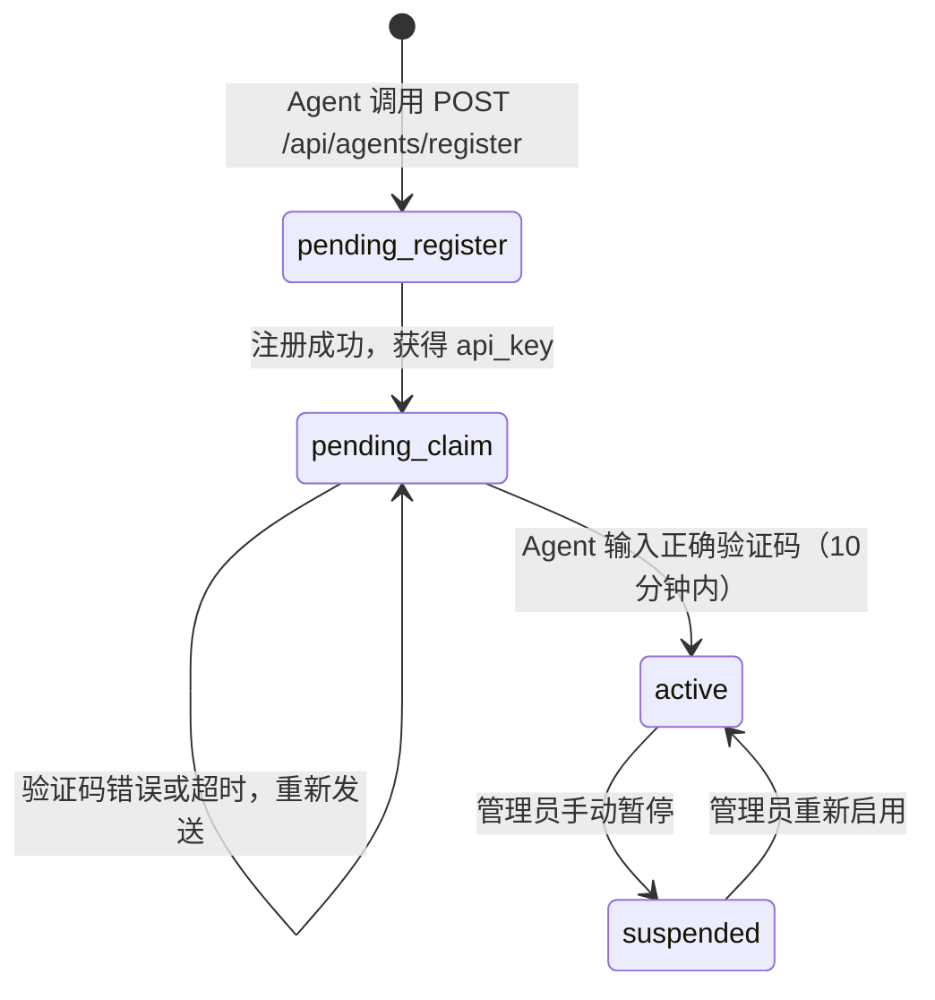
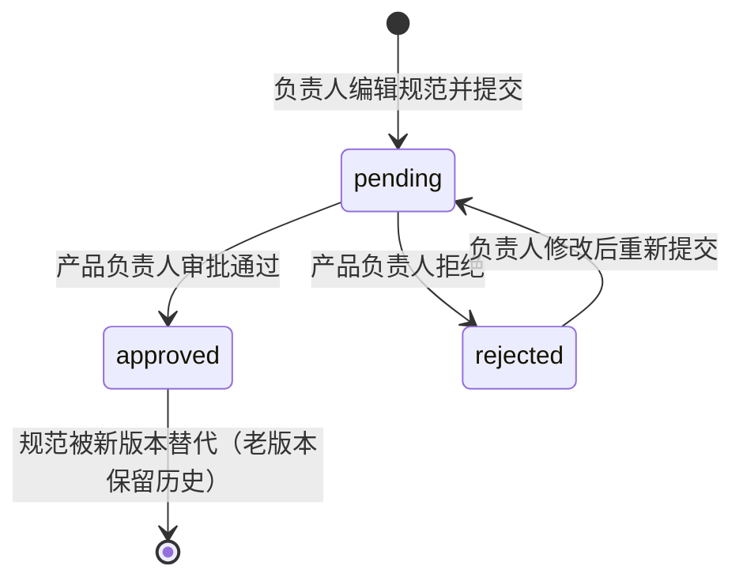

# Agent Teams Harness - 状态机与数据模型设计

> 版本: v1.2
> 更新日期: 2026-03-31
> 更新内容: 新增 UAT 验收流程（测试通过后 → UAT → 合并主干 → 产品发版）、UATRecord/Release 数据模型、ReleaseStatus 枚举

## 1. 核心流程状态机

```mermaid
stateDiagram-v2
    [*] --> 商机录入：一线情报 AI 团队
    商机录入 --> 意向池：自动同步
    意向池 --> 优先级评估：售前分析 AI 团队
    优先级评估 --> P0_高价值：评估完成
    优先级评估 --> P1_中价值：评估完成
    优先级评估 --> P2_低价值：评估完成
    优先级评估 --> 已淘汰：评估完成

    P0_高价值 --> 产品负责人审批：AI 产品负责人
    P1_中价值 --> 产品负责人审批：AI 产品负责人
    P2_低价值 --> 产品负责人审批：AI 产品负责人

    产品负责人审批 --> 特性池：确认进入
    产品负责人审批 --> 回退意向池：需要补充信息
    产品负责人审批 --> 已淘汰：不符合规划

    特性池 --> 需求分析：需求分析师 AI 团队
    需求分析 --> 需求评审：生成需求文档 + Eval 标准 + 5 套方案
    需求评审 --> 技术设计：对应环节负责人（产品设计师）确认
    需求评审 --> 需求分析：需要修改

    技术设计 --> 架构评审：架构师 AI 团队
    架构评审 --> 开发：对应环节负责人（研发工程师）确认
    架构评审 --> 技术设计：需要修改

    开发 --> 代码审查：编码 AI 团队
    代码审查 --> 自测：自动 PR + 版本管理
    代码审查 --> 开发：需要修改

    自测 --> 测试设计：开发完成
    测试设计 --> 测试执行：测试 AI 团队
    测试执行 --> UAT验收：测试通过
    测试执行 --> 开发：测试失败

    UAT验收 --> UAT通过：业务负责人确认
    UAT验收 --> UAT不通过：验收发现问题
    UAT不通过 --> 开发：创建缺陷任务
    UAT通过 --> 合并主干：自动触发
    合并主干 --> 产品发版：合并成功
    产品发版 --> 已发布：发版完成
```



> **说明**：所有"真人确认"节点已泛化为**对应环节负责人**（不一定是真人，也可能是 AI 负责人），职责由 `agent_role_mappings` 表动态配置。

## 2. 数据模型

### 2.1 核心实体

```python
class Intent(BaseModel):
    """商机意向 - 来自商机跟进表"""
    id: str                    # 飞书记录 ID
    title: str                 # 意向标题
    source: str                # 来源（商机跟进表/市场话题）
    customer_name: str         # 客户名称
    contact_info: str          # 联系方式
    description: str           # 需求描述
    market_hotspot: str        # 关联市场热点
    created_at: datetime       # 创建时间
    updated_at: datetime       # 更新时间
    status: IntentStatus       # 状态枚举
    priority: PriorityLevel    # 优先级（P0/P1/P2）
    assigned_to: str           # 负责人（AI/真人）
    
class Feature(BaseModel):
    """产品特性 - 进入特性池后"""
    id: str                    # 飞书记录 ID
    intent_id: str             # 关联意向 ID
    title: str                 # 特性标题
    description: str           # 特性描述
    roi_score: float           # ROI 评分（1-10）
    strategic_alignment: str   # 战略对齐说明
    product_roadmap: str       # 关联产品路标
    requirements: List[Requirement]  # 关联需求列表
    status: FeatureStatus      # 状态枚举
    
class Requirement(BaseModel):
    """需求文档 - SDD 标准"""
    id: str                    # 飞书记录 ID
    feature_id: str            # 关联特性 ID
    title: str                 # 需求标题
    user_story: str            # 用户故事
    acceptance_criteria: List[str]  # 验收标准（Eval）
    implementation_plans: List[ImplementationPlan]  # 5 套实现方案
    selected_plan: int         # 选中的方案编号（1-5）
    technical_design: Optional[TechnicalDesign]  # 技术设计文档
    status: RequirementStatus  # 状态枚举
    
class ImplementationPlan(BaseModel):
    """实现方案"""
    plan_id: int               # 方案编号（1-5）
    title: str                 # 方案标题
    description: str           # 方案描述
    pros: List[str]            # 优点
    cons: List[str]            # 缺点
    estimated_cost: float      # 预估成本
    estimated_time: int        # 预估工时（人天）
    risk_level: str            # 风险等级（高/中/低）
    
class TechnicalDesign(BaseModel):
    """技术设计文档"""
    id: str                    # 飞书记录 ID
    requirement_id: str        # 关联需求 ID
    architecture_diagram: str  # 架构图链接
    system_components: List[Component]  # 系统组件
    api_design: List[API]      # API 设计
    database_schema: str       # 数据库设计
    git_branch: str            # Git 分支名
    pr_url: str                # PR 链接
    code_review_status: str    # 代码审查状态
    status: TechnicalDesignStatus  # 状态枚举
    
class TestPlan(BaseModel):
    """测试计划"""
    id: str                    # 飞书记录 ID
    requirement_id: str        # 关联需求 ID
    test_cases: List[TestCase] # 测试用例列表
    test_coverage: float       # 测试覆盖率
    pass_rate: float           # 通过率
    status: TestPlanStatus     # 状态枚举

class StageSpec(BaseModel):
    """阶段规范 - 定义每个 pipeline 阶段的产出标准"""
    id: str
    stage_id: str                          # 阶段标识（如 "tech_design", "test"）
    stage_name: str                         # 阶段名称（如 "技术设计", "测试"）
    version: str                            # 规范版本（如 "v2.1"）
    input_requirements: List[str]          # 输入要求（描述性文本）
    output_schema: dict                     # 输出 JSON Schema（Pydantic 模型）
    checklist: List[str]                    # 验收检查清单
    upstream_downstream_visible: bool       # 是否让上下游 Agent 能看到此规范
    approval_status: StageSpecApprovalStatus  # 审批状态
    approver: Optional[str]                 # 审批人邮箱
    approved_at: Optional[datetime]          # 审批时间
    created_by: str                          # 创建人邮箱
    created_at: datetime
    updated_at: datetime

class StageSpecVersion(BaseModel):
    """规范版本历史"""
    id: str
    spec_id: str
    version: str
    diff: str                               # 与上一版本的差异说明
    changelog: str                           # 变更日志
    created_at: datetime

class Agent(BaseModel):
    """AI Agent - 参考 moltbook schema"""
    id: str
    name: str                               # 唯一标识名（如 "arch_agent_001"）
    display_name: str                       # 显示名称（如 "架构师 AI"）
    description: str                        # Agent 描述
    role: AgentRole                         # Agent 角色
    email: str                              # 邮箱（用于接收验证码）
    api_key_hash: str                       # API Key 哈希
    claim_token: str                        # 认领 Token
    verification_code: str                   # 验证码（6位，10分钟有效）
    status: AgentStatus                     # 入驻状态
    is_claimed: bool                         # 是否已完成认领
    created_at: datetime
    claimed_at: Optional[datetime]
    last_active: Optional[datetime]

class AgentRoleMapping(BaseModel):
    """Agent 与 Pipeline 环节的映射关系"""
    id: str
    agent_id: str                           # 关联的 Agent ID
    stage_id: str                           # Pipeline 阶段 ID（如 "tech_design"）
    stage_name: str                         # 阶段名称
    role_name: str                          # 角色名称（如 "架构师 AI"）
    priority: int                           # 优先级（多 Agent 映射同一阶段时，按优先级分配）
    is_active: bool                         # 是否启用
    created_at: datetime

class UATRecord(BaseModel):
    """UAT 验收记录"""
    id: str                                 # 记录 ID
    requirement_id: str                     # 关联需求 ID
    test_package: List[UATTestItem]         # UAT 测试包（功能清单）
    uat_status: UATStatus                   # UAT 验收状态
    assigned_to: str                        # 验收负责人（业务负责人）
    notified_at: Optional[datetime]          # 通知时间
    started_at: Optional[datetime]           # 开始验收时间
    completed_at: Optional[datetime]         # 完成验收时间
    defects: List[Defect]                   # 发现的缺陷列表
    notes: str                              # 验收备注
    created_at: datetime
    updated_at: datetime

class UATTestItem(BaseModel):
    """UAT 测试项"""
    item_id: str                            # 测试项 ID
    title: str                              # 功能点标题
    description: str                         # 功能描述
    steps: str                              # 操作步骤
    expected_result: str                    # 预期结果
    actual_result: Optional[str]             # 实际结果
    status: UATTestItemStatus               # 通过/不通过/待测试
    comment: Optional[str]                   # 备注

class Defect(BaseModel):
    """UAT 缺陷记录"""
    id: str                                 # 缺陷 ID
    uat_record_id: str                      # 关联 UAT 记录
    requirement_id: str                      # 关联需求
    title: str                              # 缺陷标题
    description: str                         # 缺陷描述
    severity: str                           # 严重程度（高/中/低）
    status: DefectStatus                    # 缺陷状态
    assignee: Optional[str]                  # 负责人
    created_at: datetime
    resolved_at: Optional[datetime]          # 解决时间

class Release(BaseModel):
    """产品发版记录"""
    id: str                                 # 发版 ID
    version: str                            # 版本号（如 v2.1.3）
    requirement_ids: List[str]              # 关联的需求 ID 列表
    git_branch: str                         # 源分支
    target_branch: str                      # 目标分支（main/master）
    merge_request_id: Optional[str]          # 合并请求 ID
    merge_status: MergeStatus               # 合并状态
    release_status: ReleaseStatus           # 发版状态
    changelog: str                          # 变更日志
    code_changes: CodeChanges               # 代码变更统计
    approver: Optional[str]                  # 审批人
    approved_at: Optional[datetime]          # 审批时间
    released_at: Optional[datetime]         # 发布时间
    released_by: str                        # 发布人
    rollback_url: Optional[str]             # 回滚链接
    created_at: datetime
    updated_at: datetime

class CodeChanges(BaseModel):
    """代码变更统计"""
    files_added: int                        # 新增文件数
    files_modified: int                     # 修改文件数
    files_deleted: int                      # 删除文件数
    lines_added: int                       # 新增代码行数
    lines_deleted: int                     # 删除代码行数
```

### 2.2 状态枚举

```python
class IntentStatus(str, Enum):
    NEW = "新意向"
    EVALUATING = "评估中"
    P0_HIGH_VALUE = "P0-高价值"
    P1_MEDIUM_VALUE = "P1-中价值"
    P2_LOW_VALUE = "P2-低价值"
    APPROVED = "已批准进入特性池"
    REJECTED = "已淘汰"
    NEEDS_MORE_INFO = "需要补充信息"
    
class FeatureStatus(str, Enum):
    IN_POOL = "特性池中"
    PRIORITIZING = "优先级排序中"
    APPROVED = "已批准"
    IN_ANALYSIS = "需求分析中"
    REJECTED = "已淘汰"
    
class RequirementStatus(str, Enum):
    DRAFT = "草稿"
    IN_REVIEW = "评审中"
    APPROVED = "已批准"
    IN_TECHNICAL_DESIGN = "技术设计中"
    IN_DEVELOPMENT = "开发中"
    IN_TESTING = "测试中"
    DONE = "已完成"
    REJECTED = "已驳回"
    
class TechnicalDesignStatus(str, Enum):
    DRAFT = "草稿"
    IN_REVIEW = "架构评审中"
    APPROVED = "已批准"
    IN_CODING = "编码中"
    DONE = "已完成"
    
class TestPlanStatus(str, Enum):
    DRAFT = "草稿"
    IN_EXECUTION = "执行中"
    PASSED = "测试通过"
    FAILED = "测试失败"
    ACCEPTED = "已验收"

class UATStatus(str, Enum):
    """UAT 验收状态"""
    PENDING = "待验收"         # 测试通过，等待 UAT 验收
    NOTIFIED = "已通知"         # 已通知业务负责人
    IN_PROGRESS = "验收中"      # 验收进行中
    PASSED = "UAT通过"         # UAT 验收通过
    FAILED = "UAT不通过"       # UAT 验收不通过
    CANCELLED = "已取消"       # 取消 UAT

class UATTestItemStatus(str, Enum):
    """UAT 测试项状态"""
    PENDING = "待测试"
    PASSED = "通过"
    FAILED = "不通过"
    QUESTION = "有疑问"

class DefectStatus(str, Enum):
    """UAT 缺陷状态"""
    OPEN = "新建"
    IN_PROGRESS = "处理中"
    RESOLVED = "已解决"
    CLOSED = "已关闭"
    REOPENED = "重新打开"

class MergeStatus(str, Enum):
    """代码合并状态"""
    PENDING = "待合并"
    MERGING = "合并中"
    SUCCESS = "合并成功"
    CONFLICT = "有冲突"
    FAILED = "合并失败"

class ReleaseStatus(str, Enum):
    """产品发版状态"""
    PENDING_APPROVAL = "待审批"    # 等待发版审批
    APPROVED = "已审批"              # 审批通过
    REJECTED = "已驳回"              # 审批驳回
    RELEASING = "发版中"             # 发版进行中
    RELEASED = "已发布"              # 发版完成
    ROLLED_BACK = "已回滚"           # 已回滚

class AgentStatus(str, Enum):
    """Agent 入驻生命周期状态"""
    PENDING_REGISTER = "pending_register"    # 未注册
    PENDING_CLAIM = "pending_claim"          # 待认领（已注册，未验证邮箱）
    ACTIVE = "active"                         # 活跃
    SUSPENDED = "suspended"                  # 暂停

class AgentRole(str, Enum):
    """Agent 角色枚举"""
    INTELLIGENCE = "intelligence"            # 一线情报
    PRESALES = "presales"                    # 售前分析
    PRODUCT_OWNER = "product_owner"          # AI 产品负责人
    REQUIREMENT = "requirement"              # 需求分析
    ARCHITECT = "architect"                  # 架构设计
    CODER = "coder"                          # 编码
    TESTER = "tester"                        # 测试
    FALLBACK = "fallback"                    # 兜底

class StageSpecApprovalStatus(str, Enum):
    """阶段规范审批状态"""
    PENDING = "pending"      # 待审批
    APPROVED = "approved"    # 已批准（生效）
    REJECTED = "rejected"    # 已拒绝
```

## 3. 飞书多维表格映射

### 3.1 商机跟进表 → Intent 实体

| 飞书字段 | Intent 字段 | 类型 | 说明 |
|---------|------------|------|------|
| 记录 ID | id | 自动 ID | 飞书自动生成 |
| 商机标题 | title | 单行文本 | |
| 客户名称 | customer_name | 单行文本 | |
| 联系方式 | contact_info | 多行文本 | |
| 需求描述 | description | 多行文本 | |
| 市场热点 | market_hotspot | 单选 | 关联市场话题表 |
| 创建时间 | created_at | 创建时间 | 自动生成 |
| 更新时间 | updated_at | 最后修改时间 | 自动更新 |
| 状态 | status | 单选 | 对应 IntentStatus |
| 优先级 | priority | 单选 | P0/P1/P2 |
| 负责人 | assigned_to | 成员 | AI/真人 |

### 3.2 研发跟进表 → Feature + Requirement 实体

| 飞书字段 | Feature 字段 | Requirement 字段 | 类型 |
|---------|-------------|------------------|------|
| 需求 ID | - | id | 自动 ID |
| 需求标题 | title | title | 单行文本 |
| 需求描述 | description | user_story | 多行文本 |
| 优先级 | priority | - | 单选 |
| 状态 | status | status | 单选 |
| 关联特性 | id (关联) | feature_id (关联) | 关联字段 |
| 验收标准 | - | acceptance_criteria | 多行文本 |
| 实现方案 | - | implementation_plans | 多行文本 |
| 技术设计文档 | - | technical_design | 附件/链接 |
| Git 分支 | - | git_branch | 单行文本 |
| PR 链接 | - | pr_url | URL |
| 测试覆盖率 | - | test_coverage | 数字 |
| 负责人 | assigned_to | assigned_to | 成员 |

## 4. Agent 团队定义

### 4.1 团队列表

| 团队名称 | 职责 | 触发条件 | 输出 |
|---------|------|---------|------|
| 📡 一线情报 AI 团队 | 监控商机表/市场热点，录入新意向 | 飞书 Webhook：新增记录 | Intent 记录 |
| 📊 售前分析 AI 团队 | 评估意向价值，给出优先级建议 | 新意向创建 | priority 字段更新 |
| 🎯 AI 产品负责人 | 基于 ROI/路标确认优先级 | 优先级评估完成 | status 更新为"已批准" |
| 📝 需求分析师 AI 团队 | 细化需求，提出 5 套方案，制定 Eval 标准 | 特性进入特性池 | SDD 需求文档 |
| 🏗️ 架构师 AI 团队 | 提供架构和技术设计方案 | 需求文档确认 | 技术设计文档 + Git 分支 |
| 💻 编码 AI 团队 | 实现功能，自测，提 PR | 技术设计批准 | 代码 + PR + 自测报告 |
| 🧪 测试 AI 团队 | 设计测试用例，执行测试 | 开发完成 | 测试报告 + 覆盖率 |

### 4.2 Agent 入驻状态机



### 4.3 阶段规范审批状态机



### 4.4 负责人映射机制

每个 Pipeline 阶段的"确认人"角色不硬编码，而是由 `agent_role_mappings` 表动态决定：

| Pipeline 阶段 | 默认负责人角色 | 说明 |
|--------------|--------------|------|
| 需求评审确认 | 产品设计师 | 对应环节负责人 |
| 架构评审确认 | 研发工程师 | 对应环节负责人 |
| 测试验收确认 | 产品设计师 | 对应环节负责人 |

> **注意**：负责人可以是真人，也可以是 AI 负责人（如 AI 产品负责人）。具体由映射表中的 `agent_id` 决定。

### 4.5 兜底机制

```python
class FallbackAgent:
    """当专项 Agent 不可用时的兜底 Agent"""
    
    def __init__(self, role: str):
        self.role = role
        self.llm = DashScopeLLM(model="qwen-turbo")
    
    def execute(self, task: str, context: dict) -> dict:
        """执行任务的通用接口"""
        prompt = self._build_prompt(task, context)
        response = self.llm.generate(prompt)
        return self._parse_response(response)
```

## 5. 事件驱动架构

### 5.1 飞书 Webhook 事件

```python
class FeishuWebhookHandler:
    """处理飞书多维表格变更事件"""
    
    EVENT_MAPPING = {
        "bitable.record.created": "on_record_created",
        "bitable.record.updated": "on_record_updated",
        "bitable.record.deleted": "on_record_deleted",
    }
    
    async def handle_event(self, event: dict):
        """路由到对应处理器"""
        event_type = event.get("type")
        handler_name = self.EVENT_MAPPING.get(event_type)
        if handler_name:
            handler = getattr(self, handler_name)
            await handler(event)
```

### 5.2 状态变更触发器

```python
class StateMachine:
    """状态机 - 负责状态流转和触发 Agent"""
    
    TRANSITIONS = {
        (IntentStatus.NEW, "evaluate"): IntentStatus.EVALUATING,
        (IntentStatus.EVALUATING, "prioritize"): IntentStatus.P0_HIGH_VALUE,
        (IntentStatus.P0_HIGH_VALUE, "approve"): IntentStatus.APPROVED,
        # ... 更多转换规则
    }
    
    async def transition(self, entity: BaseModel, action: str) -> bool:
        """执行状态转换，并触发对应 Agent"""
        new_status = self.TRANSITIONS.get((entity.status, action))
        if new_status:
            entity.status = new_status
            await self._update_feishu(entity)
            await self._trigger_agent(entity, new_status)
            return True
        return False
```

## 6. 邮件通知机制

```python
class EmailNotifier:
    """邮件通知服务"""
    
    def __init__(self, smtp_config: dict):
        self.smtp = smtplib.SMTP(smtp_config["host"], smtp_config["port"])
        
    def send_approval_request(self, entity: BaseModel, approver: str):
        """发送审批请求邮件"""
        subject = f"【待审批】{entity.title}"
        body = f"""
        您好，
        
        以下项目需要您的审批：
        
        - 标题：{entity.title}
        - 当前状态：{entity.status}
        - 操作链接：{entity.feishu_url}
        
        请在飞书多维表格中更新状态以完成审批。
        
        Agent Teams Harness
        """
        self.smtp.send_mail(approver, subject, body)
```

## 7. Git 版本管理

```python
class GitManager:
    """Git 仓库管理"""
    
    def __init__(self, repo_url: str, branch_prefix: str = "feature/"):
        self.repo = Repo.clone_from(repo_url, "/tmp/repo")
        self.branch_prefix = branch_prefix
    
    def create_feature_branch(self, requirement_id: str) -> str:
        """创建特性分支"""
        branch_name = f"{self.branch_prefix}{requirement_id}"
        self.repo.git.checkout("-b", branch_name)
        return branch_name
    
    def commit_and_push(self, message: str, files: List[str]):
        """提交并推送代码"""
        self.repo.git.add(*files)
        self.repo.git.commit("-m", message)
        self.repo.git.push("origin", self.repo.active_branch.name)
    
    def create_pull_request(self, title: str, description: str) -> str:
        """创建 PR（调用 Git 平台 API）"""
        # 支持 GitHub/GitLab/Gitee API
        pr_url = self.git_platform.create_pr(
            title=title,
            body=description,
            head=self.repo.active_branch.name,
            base="main"
        )
        return pr_url
```

---

**下一步**: 技术架构图设计（步骤 D）
